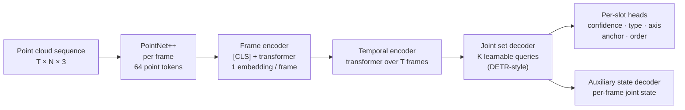

# PokeNet: Learning Kinematic Models of Articulated Objects from Human Observations

**Anmol Gupta, Weiwei Gu, Omkar Patil, Jun Ki Lee, Nakul Gopalan**

[](https://arxiv.org/abs/2602.02741)

Official PyTorch implementation of **PokeNet**. From a single human demonstration, given as a
sequence of point clouds of the object being manipulated, PokeNet estimates the object's
kinematic model:

- **which joints exist** and their **type** (revolute / prismatic),
- each joint's **axis direction** and **anchor point**,
- the **order** in which the joints were manipulated, and
- the **joint state** in every frame.

It needs no prior knowledge of the object category, the number of joints, or a part segmentation.
Because it reasons over the whole interaction, it can recover joints that only become visible once
the object is manipulated. See the [paper](https://arxiv.org/abs/2602.02741) for details and benchmark results.

---

## Method



1. **Spatial encoding.** Each frame is encoded by PointNet++ into point-level tokens. A learnable
   `[CLS]` token attends over them in a light transformer and gives one embedding per frame.
2. **Temporal encoding.** A transformer encoder over the frame embeddings captures how the object moves.
3. **Joint set prediction.** K learnable queries attend to the temporal memory. Each slot predicts a
   confidence `c`, a type `τ`, a unit axis `d`, an anchor `p` on the axis, and an order score `o`.
4. **Joint states.** An auxiliary decoder predicts each joint's displacement relative to the first
   frame: `(sin θ, cos θ, 0)` for revolute joints and `(0, 0, ρ)` for prismatic joints.
5. **Training.** Predicted slots are matched to ground-truth joints with the Hungarian algorithm and trained with

   `L = λ_conf·BCE + λ_type·CE + λ_axis·(1 − |⟨d̂, d⟩|) + λ_point·d(p̂, line)² + λ_order·L1 + λ_rank·hinge + λ_state·MSE`

6. **Inference.** Slots with confidence above μ are kept and sorted by order score.

---

## Installation

```bash
git clone https://github.com/gupta-anmol99/Object-Kinematic-Modeling.git pokenet && cd pokenet
conda create -n pokenet python=3.10 -y && conda activate pokenet

# PyTorch with the CUDA version that matches your driver (tested: 2.7.0 + CUDA 12.6)
pip install torch==2.7.0 --index-url https://download.pytorch.org/whl/cu126
pip install -r requirements.txt
```

The PointNet++ layers are implemented in plain PyTorch, so there are no custom CUDA extensions to compile.

---

## Data

Each demonstration is a folder of per-frame point clouds plus a `meta.json` with the ground truth:

```
data/<dataset>/
  <category>_<index>/            e.g. fridge_000012/
    point_cloud_000000.pcd       frame 0 (camera frame, metres)
    ...
    point_cloud_000011.pcd       frame T-1
    meta.json
```

```jsonc
{
  "joint_count": 2,                          // M
  "joint_params": [                          // J rows (J ≥ M), unused rows filled with -1
    [dx, dy, dz, px, py, pz, type],          // axis direction, a point on the axis, 0 = revolute / 1 = prismatic
    ...
  ],
  "joint_deltas": [                          // T rows × J columns: joint value per frame
    [q1_t0, q2_t0, -1],                      // radians (revolute) or metres (prismatic)
    ...
  ]
}
```

- Point clouds and joint parameters must be in the **same coordinate frame**.
- The folder-name prefix before the last `_` is the **category**, used for unseen-category splits.
- Points at or beyond the depth far plane (`z ≥ 5 m`) are treated as background and dropped.
- Each sequence is normalized once, using the center and scale of its first frame; the same
  transform is applied to the ground truth. Predictions are mapped back to metres.
- The manipulation order is inferred from `joint_deltas` (the first frame each joint moves), so
  the rows of `joint_params` can be in any order.

---

## Training

```bash
python train.py --data_root data/sim --out_dir checkpoint/pokenet \
    --epochs 30 --batch_size 8 --num_points 4096 --lr 2e-4
```

**Unseen categories.** Train on some categories and validate on held-out ones:

```bash
python train.py --data_root data/sim --out_dir checkpoint/unseen \
    --train_categories microwave laptop fridge drawer --test_categories furniture box toilet pliers
```

Without `--test_categories`, a random `--val_frac` split (default 10%) is used. `best.pt` (lowest
validation loss) and `last.pt` are written to `--out_dir`; add `--wandb` to log to Weights & Biases.

| Argument | Default | Meaning |
|---|---|---|
| `--num_points` | 8192 | points per frame after resampling |
| `--sequence_length` | 12 | frames per demonstration |
| `--num_queries` | 6 | K joint slots (must exceed the maximum number of joints) |
| `--w_state` | 1.0 | weight of the joint-state loss |
| `--eos_coef` | 0.5 | weight of unmatched ("no joint") slots in the confidence loss |
| `--w_conf_match` | 1.0 | confidence term in the Hungarian cost (0 = type + axis + anchor only) |
| `--mu` | 0.5 | confidence threshold used for the count metric |

Memory: batch 8 × 12 frames × 4096 points uses about 11 GB of GPU memory.

---

## Evaluation

```bash
python evaluate.py --ckpt checkpoint/pokenet/best.pt --data_root data/sim [--categories box toilet] [--out metrics.json]
```

| Metric | Definition |
|---|---|
| `axis_deg` | angle between the predicted and ground-truth axis (sign-agnostic), degrees |
| `disp_cm` | minimum distance between the predicted and ground-truth axis lines (revolute joints), cm |
| `state_deg` / `state_cm` | mean per-frame joint-state error for revolute (deg) / prismatic (cm) joints |
| `type_acc` | joint-type accuracy |
| `count_acc` | fraction of sequences where the number of slots with confidence > μ equals the true number of joints |
| `order_acc` | fraction of multi-joint sequences whose predicted manipulation order is exactly right |

Parameter errors are computed on Hungarian-matched (prediction, ground truth) pairs, in metres, in the camera frame.

---

## Inference

Run a trained model on any demonstration folder (only `point_cloud_*.pcd` files are needed):

```bash
python infer.py --ckpt checkpoint/pokenet/best.pt --sequence path/to/demo --out joints.json
```

```
joint 0: revolute  conf 1.00  axis [0.0025, -0.9814, 0.1918]  anchor [0.4064, 0.0351, 3.1997] m  final state 78.122 deg
```

`joints.json` lists the joints in predicted manipulation order, with type, confidence, axis,
anchor (metres, camera frame) and the joint state in every frame.

From Python:

```python
from models.SequencePointCloudDataset import load_sequence
from evaluate import load_model
import torch

model, ckpt = load_model("checkpoint/pokenet/best.pt", "cuda")
seq, center, scale = load_sequence("path/to/demo", num_points=ckpt["data_kwargs"]["num_points"])
joints = model.predict(seq[None].cuda(), torch.tensor(center)[None].cuda(), torch.tensor([scale]).cuda())[0]
```

---

## Results

PokeNet is evaluated on 15 PartNet-Mobility categories in simulation (4 of them unseen during training)
and on real human demonstrations, against ScrewNet and GAPartNet. Per-category axis orientation,
axis displacement and joint-state errors are reported in Tables II and III of the
[paper](https://arxiv.org/abs/2602.02741).

---

## Notes

- **Axis sign.** The axis loss is sign-agnostic (`1 − |cos|`), so a predicted axis may point either
  way along the line. Joint states follow the sign convention of the training labels, so check the
  axis sign against your convention before using a predicted angle to drive a robot.
- **Matching cost.** By default the Hungarian cost includes the slot confidence (as in DETR), which
  stops duplicate slots from predicting the same joint. Set `--w_conf_match 0` to use only type, axis and anchor.
- The paper does not specify some hyperparameters (K, μ, loss weights, network sizes); the
  values here are the defaults in the code.

---

## Repository structure

```
models/
  PokeNet.py                    full model, predict() / decode_predictions()
  Pointnet2Encoder.py           PointNet++ set-abstraction backbone
  pointnet_utils.py             FPS, ball query, grouping, resampling, normalization
  FrameEncoder.py               per-frame [CLS] transformer
  SequenceEncoder.py            backbone + frame encoder over all frames
  TemporalEncoder.py            temporal transformer
  DETRDecoder.py                joint queries, slot heads, state head
  HungarianMatcher.py           set matching (+ matcher_utils.py)
  GTAdapter.py                  labels → matching / loss targets (order, states)
  loss.py                       set loss
  metrics.py                    evaluation metrics
  SequencePointCloudDataset.py  data loading and normalization
train.py  evaluate.py  infer.py
```

---

## Citation

```bibtex
@article{gupta2026pokenet,
  title   = {PokeNet: Learning Kinematic Models of Articulated Objects from Human Observations},
  author  = {Gupta, Anmol and Gu, Weiwei and Patil, Omkar and Lee, Jun Ki and Gopalan, Nakul},
  journal = {arXiv preprint arXiv:2602.02741},
  year    = {2026}
}
```

## Acknowledgements

The simulated objects come from [PartNet-Mobility](https://sapien.ucsd.edu/). The architecture builds on
[PointNet++](https://arxiv.org/abs/1706.02413) and [DETR](https://arxiv.org/abs/2005.12872).
